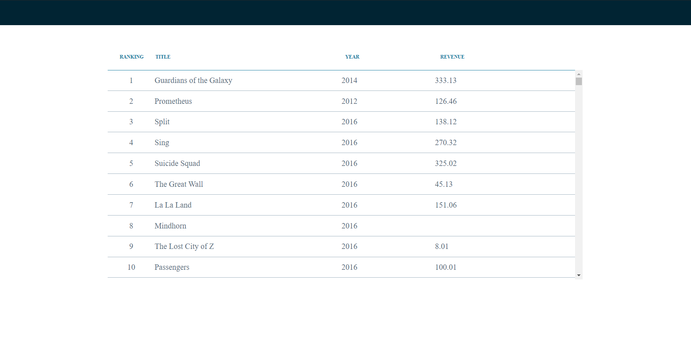
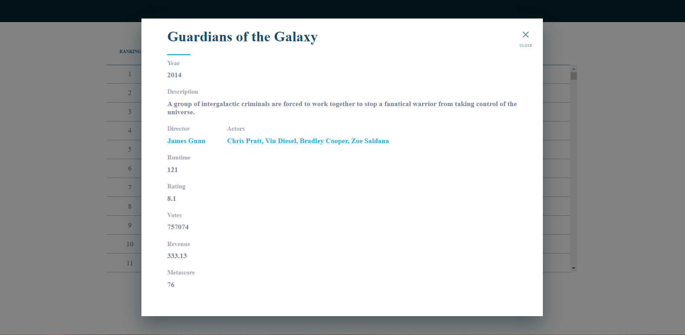
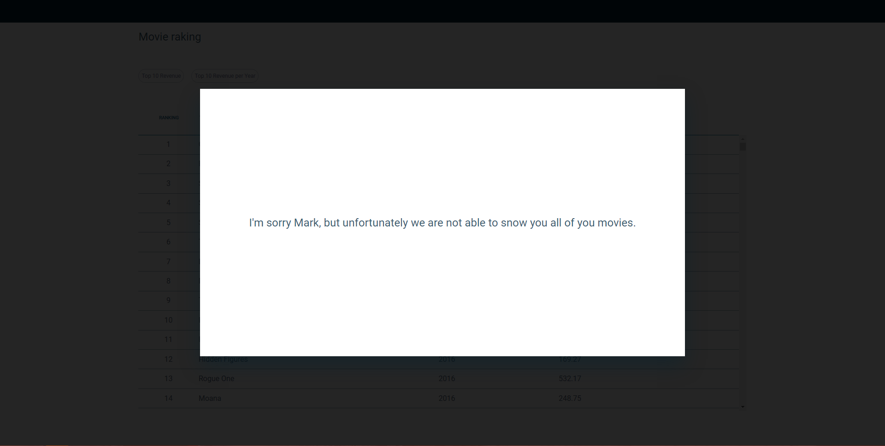

# Narciso Daniel Correia [Mark's Movies List Challenge](https://github.com/narcisocorreia/movies-challenge)

## Add get Movie List and Movie detail Request [0d367f8](https://github.com/narcisocorreia/movies-challenge/commit/85e0bc20f9eea7d3c298472fb5f0a9a6dab838fb)

In this commit i started with the basics request fetching the movies list and movies details so that it is easy to start creating the base list of movies and movie details popUp

## Movies List Layout [b6209c7](https://github.com/narcisocorreia/movies-challenge/commit/b6209c7a19b2653f851929818915010ccac446c5)

In this commit I developed the movies list layout.

I started by adding the [styled-components lib](https://styled-components.com/), I did this because after starting using this lib in my current job and in my personal project I believe that it make the code more easer to read.

Then I started to get the dimension of the list body. The dimension I got here :

- width: 68.7%;

  - I got this value with by divide with of the a line in the list, **938px**, multiplied by **100**, the full width of the page on the Adobe XD, **1366px**. And I rounded the number to 1 decimal house

- height: 69.7%;

  - I got this value using a similar process like the on I use to calculate the width. I start to calculate the value of the component height, so seeing the difference between the last line and the end of page. Then to that number I added the difference between the fist Line, where I mean the line with the column titles, and the page start. The total was **233px**, then I multiplied by **100**, the full width of the page on the Adobe XD, **768px**. And I rounded the number to 1 decimal house

I decided to make it a grid, I thought that would me simple and more structure secure if the div was build was a grid. And with a grid implemented it was easy to make the columns have the space that was requested.

- raking
- title
- year
- rev

**Reason for my Approach**
Then I list all the movies that the come in the API request, using the map, returning an object showing the values asked.

## Add Info PopUp Layout [4d03e4d](https://github.com/narcisocorreia/movies-challenge/commit/4d03e4d4c62a272f4dadf1b3e77ebe1b001f2444)

In this commit I created the base layout for popUp with the movie information.

For the popup it self I took the same approach that I used in last commit. I calculate the width and height by divide the popUp size multiplied by 100 by the page size.

## Add filter info options [4a90204](https://github.com/narcisocorreia/movies-challenge/commit/4a902042cf978df10c03d4051b6ea26b137c287d)

In this PR I created the options to filter list of movies by the top most revenue or the Year XXXX top revenue.

To stated I created a simple div to contain all the to contain all the button that filter the movie list.

I created a state to hold the original information received, then when the user selected the option of top revenue or top revenue per year a copy of the original information is created, in the case of the option is the top revenue that new copy is sorted from the objected with with the highest revenue to the lowest. In the case of the top revenue per year, a new copy of the original is created, then I selected all the objects where the year equals the one that was selected, then the objects are sorted from the object to with the highest revenue to the lowest.

To show the list of items that where according to the options that are selected, I created a state that holds that information, and when a option is selected and the new information is created that information is always in that useState. This means that there is only list of movies "object" and the only thing need to be done is to change the value of the state that contains the information that was to be listed.

I also use the same approach for the development of the division that contains the list of year that was use before for the information popUp and the list movies.

## Create Years List Dynamically [020c574](https://github.com/narcisocorreia/movies-challenge/commit/020c574b7d559cd7095e8eded446ca9ae1b21f96)

In this commit I created an algorithm that filters all the different years that are in the movies container, now when a user selects the option revenue per year all the years it only appears years that there is an actually movie information on the list.

## Create option bar component [6eaab80](https://github.com/narcisocorreia/movies-challenge/commit/6eaab8032c4fa6a9f29d1c339c809bb82f1d5081)

This was a simple refactor to the code, creating the option bar component, with this App.jsx file is easer to read and more organized.

## Error PopUp [523169e](https://github.com/narcisocorreia/movies-challenge/commit/523169eea071864a0e9af8e2fca8fc55086440b7)

Creating a simple popUp so that in case the API request does not work we warn Mark that unfortunately the we can see the movies list.

## Add search movies option [53ff4be](https://github.com/narcisocorreia/movies-challenge/commit/53ff4be0af84e234756866f40da98a63e49fdd81)

In this commit I created a new feature to allow mark to search for a movie with a specific details, this being name, id, rank, revenue. To do this I simply created a function that receives a string, then I compare the stringify values of every movie with the string that the function was received. I decided to make all values sting so that all values were from the same type. Then if any of does values contains the string that was received ist pushes that element to a new array of elements.
A improvements to this feature would be adding the options to search for actor, directs. I didn't developed that part because I decided only to make the request for that information when Mark selects a movie.

## Self Evaluation

I really like this simple challenge that can be use to make a developer think and let is imagination flow.

In case that this was an Client Projects our if the time to compleat the challenge was bigger the would be some thing I would do different :

1. **TypeScript** -> I think that TypeScript could be very usefully no only for organization propose but to be certain that the value that are passed from component to component mach and are the type that are expected to be.

2. **Redux** -> I think that using Redux could be a good option because. With Redux it would be easy to share value from component to component without the need to passed then as props. This would also mean that all the values could be found in a central file which make in my mind the code easer to understand and use.

I decide to use React to complete the challenge, but I think is a very simple but compleat challenge to try to do in Angular, and with that learn Angular.

I think that one of may weaker point might be the name that i give o variable and functions. I tried to make it easer to read and with the name of the variable it easy to understand the propose of the value.
