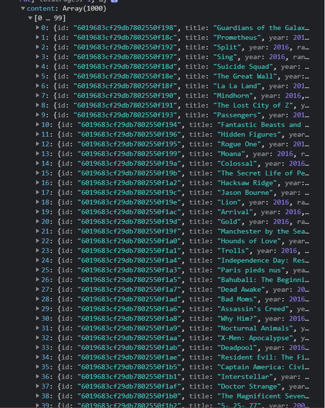
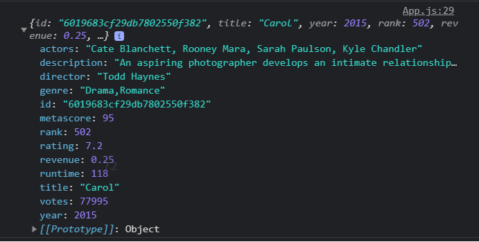

# Add get Movie List and Movie detail Request [82b461b](https://github.com/narcisocorreia/movies-challenge/commit/85e0bc20f9eea7d3c298472fb5f0a9a6dab838fb)

In this commit i started with the basics request fetching the movies list and movies details so that it is easy to start creating the base list of movies and movie details popUp

